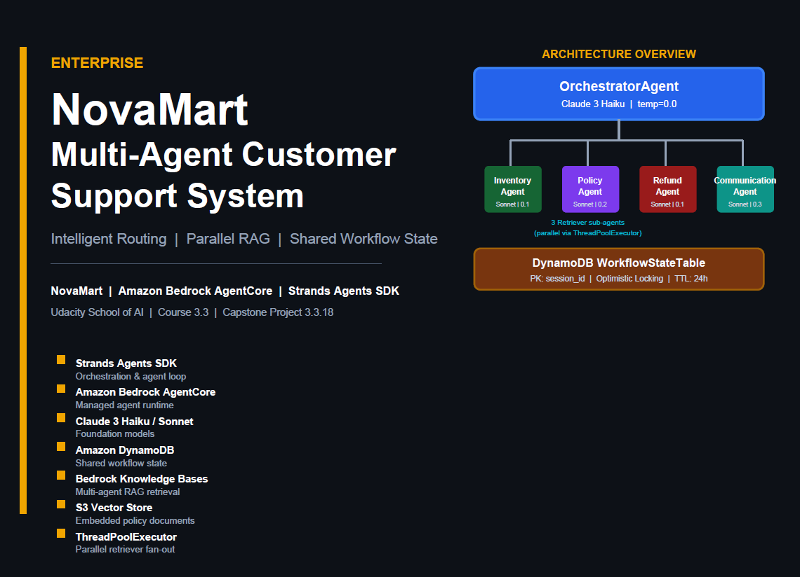
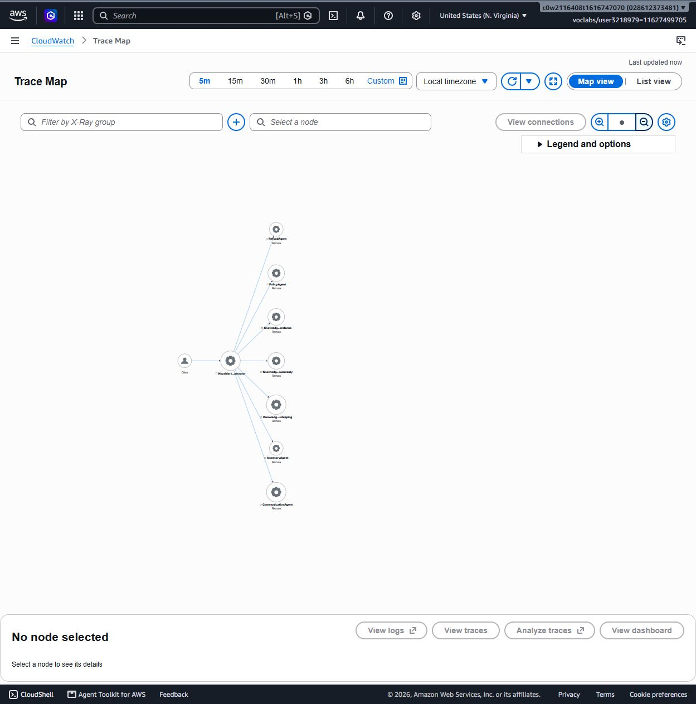
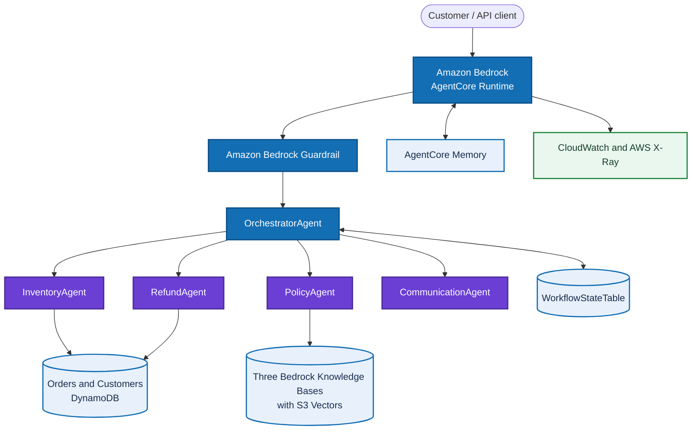
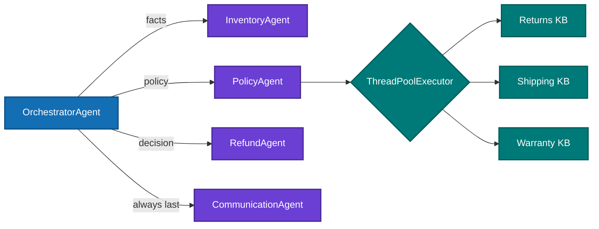
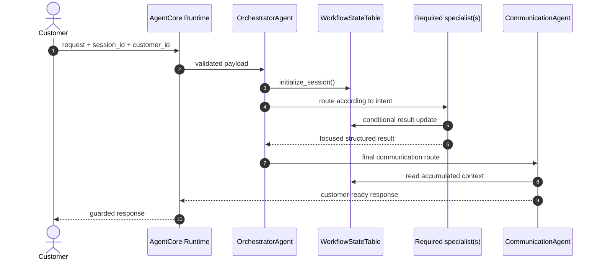
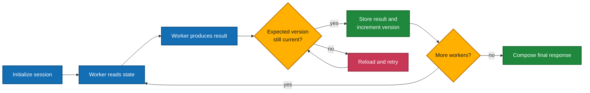

# Multi-Agent E-commerce RAG on Amazon Bedrock AgentCore

[](https://github.com/Nitin-Mane/Multi-Agent-E-commerce-RAG/actions/workflows/validate.yml)
[](https://github.com/Nitin-Mane/Multi-Agent-E-commerce-RAG/actions/workflows/deploy.yml)


[](LICENSE)



*NovaMart project cover and conceptual agent topology. The reviewed Mermaid diagrams below and `config.py` are authoritative for the submitted architecture and model configuration.*

This repository contains my Udacity AWS assignment implementation of a multi-agent retrieval-augmented generation (RAG) assistant for an e-commerce customer-support use case. A supervisor coordinates inventory, refund, policy, and communication specialists. The solution uses Amazon Bedrock, Amazon Bedrock Knowledge Bases with S3 Vectors, DynamoDB, S3, Bedrock AgentCore Runtime, AgentCore Memory, CloudWatch, and AWS X-Ray.

The official assignment run recorded **120/120** in the Udacity AWS sandbox on **October 8, 2026**. The repository includes the corresponding terminal output, AWS resource views, and connected X-Ray trace evidence.

### Live AWS verification



*CloudWatch Trace Map captured after the final three-scenario run. The map shows the NovaMart orchestrator connected to all four workers and all three knowledge-base dependencies, with no failed nodes.*

[Open the companion List view with full node names and zero faults](evidence/screenshots/aws-xray-service-list.png).

## Documentation

| Document | Purpose |
|---|---|
| [Architecture](docs/ARCHITECTURE.md) | AWS topology, Agent Graph, Request Flow, Shared `WorkflowState`, and design decisions |
| [Evidence report](docs/EVIDENCE_REPORT.md) | AWS screenshots, test transcripts, experiment details, and evidence interpretation |
| [Rubric matrix](docs/RUBRIC_MATRIX.md) | Criterion-level traceability, reviewer sequence, and verification checklist |
| [Deployment guide](docs/DEPLOYMENT.md) | Provisioning, validation, evidence capture, and cleanup |
| [CI/CD and lifecycle](docs/CI_CD.md) | GitHub Actions controls, protected AWS delivery, and resource lifecycle |

## Architecture

The application uses a hub-and-spoke design:



- `OrchestratorAgent` initializes the session, routes each request, and coordinates the final response.
- `InventoryAgent` uses three DynamoDB-backed tools for order and customer context.
- `RefundAgent` validates refund eligibility and updates order state.
- `PolicyAgent` searches returns, shipping, and warranty knowledge bases in parallel.
- `CommunicationAgent` turns structured worker results into a customer-ready response.
- Shared `WorkflowState` records are stored in DynamoDB, while AgentCore Memory provides seven-day session summaries.

The agents use Amazon Bedrock models through the Strands Agents SDK. Independent retrieval tasks can run concurrently, which reduces end-to-end latency for questions that require more than one knowledge source. See [Architecture Notes](docs/ARCHITECTURE.md) for the design rationale and request flow.

### Agent Graph

The graph follows the Udacity-specified Orchestrator → Workers pattern. The Haiku orchestrator exposes five routing tools; the four Sonnet workers own inventory lookup, policy RAG, refund decisions, and final communication. The PolicyAgent is itself a coordinator for three parallel retriever sub-agents.



### Request Flow

Every request begins with `initialize_session`. Account and customer-tier questions use InventoryAgent and never PolicyAgent. Order-status questions use InventoryAgent followed by RefundAgent for status or eligibility evaluation only; a refund is initiated only when the customer explicitly asks for one. Policy-only questions use PolicyAgent, and CommunicationAgent is always the final worker. Results are written to shared state between steps instead of being passed only through prompts.



### Shared WorkflowState

`WorkflowStateTable` is keyed by `session_id` and stores `customer_id`, version, timestamps/TTL, and each agent result. Updates use an `expected_version` condition and retry on conflicts, preventing concurrent workers from silently overwriting newer state.



See [Architecture](docs/ARCHITECTURE.md) for the color-coded deployment topology, Agent Graph, Request Flow, Shared `WorkflowState` diagrams, and role/tool matrix. `config.py` is authoritative for the submitted Claude Haiku 4.5 and Claude Sonnet 4.5 defaults.

## Project highlights

- Five-agent orchestration with explicit routing and specialist responsibilities
- Parallel RAG over three Bedrock knowledge bases backed by S3 Vectors
- Durable workflow state in DynamoDB and session summaries in AgentCore Memory
- AgentCore Runtime deployment configuration and invocation support
- Guardrail-aware response handling and operational error messages
- Infrastructure-as-code for the data plane and AgentCore prerequisites
- Local regression tests plus AWS-backed assignment validation

## Repository layout

```text
.
|-- agentcore/                  # AgentCore templates and CDK source
|-- diagrams/                  # Architecture diagrams
|-- docs/                      # Architecture, evidence, rubric, deployment, and CI/CD guides
|-- evidence/                  # AWS captures and test transcripts
|-- infrastructure/            # CloudFormation and deployment helpers
|-- src/                       # Agents, tools, workflow state, and runtime entrypoint
|-- tests/                     # Assignment and public-repository validation
|-- .env.example               # Safe environment-variable template
|-- .env                       # Populated evaluator resource identifiers
|-- config.py                  # Shared application configuration
|-- requirements.txt           # Runtime dependencies
`-- requirements-dev.txt       # Contributor dependencies
```

## Prerequisites

- Python 3.12
- AWS CLI v2 configured for the account you intend to use
- Node.js 20 or later for the CDK project
- `uv` and the AgentCore CLI (`npm install -g @aws/agentcore@0.30.0`)
- Access to the required Amazon Bedrock foundation model and embedding model

AWS services can incur charges. Use a sandbox account where possible, follow account policies, and run the cleanup steps after evaluation.

## Quick start

1. Create and activate a virtual environment, then install dependencies:

   ```powershell
   py -3.12 -m venv .venv
   .\.venv\Scripts\Activate.ps1
   python -m pip install --upgrade pip
   pip install -r requirements-dev.txt
   ```

2. Review the populated evaluator configuration. To target a different account, start from the example:

   ```powershell
   Copy-Item .env.example .env -Force
   Copy-Item agentcore\agentcore.example.json agentcore\agentcore.json
   Copy-Item agentcore\aws-targets.example.json agentcore\aws-targets.json
   ```

3. Verify that the active AWS identity is the intended Udacity sandbox or personal account:

   ```powershell
   aws sts get-caller-identity
   aws configure get region
   ```

4. Populate the resource identifiers for the target AWS environment.

5. Follow [Deployment Guide](docs/DEPLOYMENT.md) to provision the resources, ingest the sample data, create the knowledge bases, deploy the runtime, and validate the application.

## Testing

Run the repository safety and structure checks without AWS credentials:

```powershell
$env:PYTHONDONTWRITEBYTECODE = "1"
$env:PYTHONUTF8 = "1"
python -m unittest tests.test_public_repository -v
python -m unittest tests.test_documentation_structure -v
python -m unittest tests.test_security_defaults -v
python tests\run_task2_ci.py
```

The wrapper runs Udacity's supplied `tests/test_agent.py task2` unchanged and converts its printed score into a reliable process exit status for CI.

Tasks 3-6 in `tests/test_agent.py` are integration checks. They require the AWS resources and local identifiers created during deployment:

```powershell
python tests\test_agent.py all
```

The validation workflow runs credential-free checks only. The separate delivery workflow is manual, protected by a GitHub Environment, and cannot access AWS until an administrator configures an OIDC role.

## CI/CD

- **Continuous integration:** `.github/workflows/validate.yml` runs secret/publication policy checks, Python lint and compilation, the 40-point credential-free rubric suite, and the AgentCore CDK build/tests on pushes and pull requests.
- **Continuous delivery:** `.github/workflows/deploy.yml` is manual-only and uses GitHub OIDC to assume an AWS role. It validates and deploys the foundational CloudFormation stack without storing long-lived AWS keys.
- Configure the protected `aws-course` GitHub Environment and an `AWS_ROLE_ARN` repository variable before running delivery. Keep approval gates enabled for chargeable AWS deployment.

See [CI/CD Guide](docs/CI_CD.md) for setup, controls, and the parts of AgentCore deployment that remain intentionally manual.

## Rubric coverage

| Rubric task | Evidence in this repository | Verified assignment result |
|---|---|---:|
| Task 2 - agents and tools | `src/`, `config.py`, unit checks | 40/40 |
| Task 3 - runtime and guardrails | `src/agent_orchestrator.py`, `agentcore/`, guardrail configuration | 20/20 |
| Task 4 - AgentCore Memory | Memory deployment and seven-day summary strategy | 15/15 |
| Task 5 - knowledge bases | `src/bedrock_kb_retrieval.py`, `infrastructure/` | 25/25 |
| Task 6 - observability | `src/agent_observability.py`, CloudWatch and X-Ray configuration | 20/20 |
| **Total** | Automated rubric validation recorded October 8, 2026 | **120/120** |

The [Rubric Matrix](docs/RUBRIC_MATRIX.md) contains the detailed criterion-to-evidence mapping, recommended review sequence, and evaluator checklist.

The [Live Experiment and Screenshot Evidence Report](docs/EVIDENCE_REPORT.md) documents the AWS account, region, exact commands, model configuration, trace IDs, resource identifiers, screenshots, and evidence-to-source traceability.

### Required submission evidence

- [120/120 terminal screenshot](evidence/screenshots/official-tests-120-of-120.png)
- [120/120 test transcript](evidence/transcripts/official-all-tasks-2026-10-08-original.txt)
- [AgentCore Runtime screenshot](evidence/screenshots/aws-agentcore-runtime.jpg)
- [Knowledge Bases screenshot](evidence/screenshots/aws-knowledge-bases.jpg)
- [AWS X-Ray Trace Map](evidence/screenshots/aws-xray-service-map.png)
- [AWS X-Ray List view with full node names and zero faults](evidence/screenshots/aws-xray-service-list.png)
- [Task 3 runtime and guardrail output](evidence/transcripts/task3-runtime-guardrail-sanitized.txt)
- [Task 5 three-domain retrieval output](evidence/transcripts/task5-kb-retrieval-sanitized.txt)
- [Task 6 observability output](evidence/transcripts/task6-observability-after-traces-sanitized.txt)
- [Final trace-generation transcript](evidence/transcripts/trace-generation-2026-10-08-original.txt)
- [Populated `.env`](.env)
- [Detailed evidence report](docs/EVIDENCE_REPORT.md)

## Known limitation

The rubric-required defaults remain Claude Haiku 4.5 for orchestration and Claude Sonnet 4.5 for workers. The Udacity sandbox did not grant the Marketplace entitlement for Haiku 4.5, so the fresh evidence run used the documented `ORCHESTRATOR_MODEL_ID=amazon.nova-lite-v1:0` runtime override while retaining Sonnet 4.5 workers. All three scenarios completed and published X-Ray traces; this override does not change the submitted default in `config.py`.

## Cleanup

Remove the AgentCore runtime and CloudFormation stacks after evaluation to avoid ongoing costs. Confirm that S3 objects, S3 Vector resources, knowledge bases, DynamoDB tables, roles, and log groups have been deleted or retained intentionally. See [Deployment Guide](docs/DEPLOYMENT.md#cleanup).

## License

This project is available under the [MIT License](LICENSE). Course instructions and third-party services remain subject to their respective terms.
