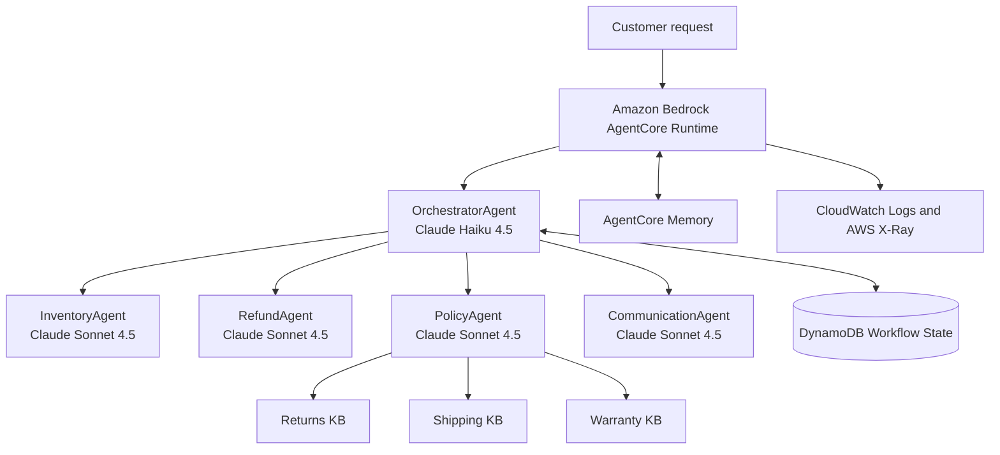

# Multi-Agent E-commerce RAG on Amazon Bedrock AgentCore

[](https://github.com/Nitin-Mane/Multi-Agent-E-commerce-RAG/actions/workflows/validate.yml)
[](https://github.com/Nitin-Mane/Multi-Agent-E-commerce-RAG/actions/workflows/deploy.yml)


[](SECURITY.md)
[](LICENSE)

This repository contains my Udacity AWS assignment implementation of a multi-agent retrieval-augmented generation (RAG) assistant for an e-commerce customer-support use case. A supervisor coordinates inventory, refund, policy, and communication specialists. The solution uses Amazon Bedrock, Amazon Bedrock Knowledge Bases with S3 Vectors, DynamoDB, S3, Bedrock AgentCore Runtime, AgentCore Memory, CloudWatch, and AWS X-Ray.

The credential-free Task 2 validation passes **40/40** locally. AWS-backed results depend on the evaluator's deployed resources and are documented with sanitized raw output in the private course submission; cloud identifiers, credentials, generated deployment artifacts, and private evidence are intentionally excluded from this public repository.



## Architecture

The application uses a hub-and-spoke design:

- `OrchestratorAgent` initializes the session, routes each request, and coordinates the final response.
- `InventoryAgent` uses three DynamoDB-backed tools for order and customer context.
- `RefundAgent` validates refund eligibility and updates order state.
- `PolicyAgent` searches returns, shipping, and warranty knowledge bases in parallel.
- `CommunicationAgent` turns structured worker results into a customer-ready response.
- Shared `WorkflowState` records are stored in DynamoDB, while AgentCore Memory provides seven-day session summaries.

The agents use Amazon Bedrock models through the Strands Agents SDK. Independent retrieval tasks can run concurrently, which reduces end-to-end latency for questions that require more than one knowledge source. See [Architecture Notes](docs/ARCHITECTURE.md) for the design rationale and request flow.

### Agent Graph

The graph follows the Udacity-specified Orchestrator → Workers pattern. The Haiku orchestrator exposes five routing tools; the four Sonnet workers own inventory lookup, policy RAG, refund decisions, and final communication. The PolicyAgent is itself a coordinator for three parallel retriever sub-agents.

### Request Flow

Every request begins with `initialize_session`. Account and customer-tier questions use InventoryAgent and never PolicyAgent. Order-status questions use InventoryAgent followed by RefundAgent for status or eligibility evaluation only; a refund is initiated only when the customer explicitly asks for one. Policy-only questions use PolicyAgent, and CommunicationAgent is always the final worker. Results are written to shared state between steps instead of being passed only through prompts.

### Shared WorkflowState

`WorkflowStateTable` is keyed by `session_id` and stores `customer_id`, version, timestamps/TTL, and each agent result. Updates use an `expected_version` condition and retry on conflicts, preventing concurrent workers from silently overwriting newer state.

See [System Architecture](docs/SYSTEM_ARCHITECTURE.md) for the full Agent Graph, Request Flow, Shared WorkflowState diagrams, and role/tool matrix.

## Project highlights

- Five-agent orchestration with explicit routing and specialist responsibilities
- Parallel RAG over three Bedrock knowledge bases backed by S3 Vectors
- Durable workflow state in DynamoDB and session summaries in AgentCore Memory
- AgentCore Runtime deployment configuration and invocation support
- Guardrail-aware response handling and operational error messages
- Infrastructure-as-code for the data plane and AgentCore prerequisites
- Credential-free unit tests plus AWS-backed assignment validation
- Public-repository controls that reject secrets, account numbers, and local deployment artifacts

## Repository layout

```text
.
|-- agentcore/                  # Sanitized AgentCore templates and CDK source
|-- diagrams/                  # Architecture diagrams
|-- docs/                      # Evaluator, rubric, deployment, and design guides
|-- infrastructure/            # CloudFormation and deployment helpers
|-- src/                       # Agents, tools, workflow state, and runtime entrypoint
|-- tests/                     # Assignment and public-repository validation
|-- .env.example               # Safe environment-variable template
|-- config.py                  # Shared application configuration
|-- requirements.txt           # Runtime dependencies
`-- requirements-dev.txt       # Contributor dependencies
```

## Prerequisites

- Python 3.12
- AWS CLI v2 configured for the account you intend to use
- Node.js 20 or later for the CDK project
- `uv` and the AgentCore CLI (`npm install -g @aws/agentcore@0.30.0`)
- Access to the required Amazon Bedrock foundation model and embedding model

AWS services can incur charges. Use a sandbox account where possible, follow account policies, and run the cleanup steps after evaluation.

## Quick start

1. Create and activate a virtual environment, then install dependencies:

   ```powershell
   py -3.12 -m venv .venv
   .\.venv\Scripts\Activate.ps1
   python -m pip install --upgrade pip
   pip install -r requirements-dev.txt
   ```

2. Create local configuration from the sanitized examples:

   ```powershell
   Copy-Item .env.example .env
   Copy-Item agentcore\agentcore.example.json agentcore\agentcore.json
   Copy-Item agentcore\aws-targets.example.json agentcore\aws-targets.json
   ```

3. Verify that the active AWS identity is the intended Udacity sandbox or personal account:

   ```powershell
   aws sts get-caller-identity
   aws configure get region
   ```

4. Populate only the local ignored files with your deployed resource identifiers. Never commit credentials, account IDs, ARNs, or session tokens.

5. Follow [Deployment Guide](docs/DEPLOYMENT.md) to provision the resources, ingest the sample data, create the knowledge bases, deploy the runtime, and validate the application.

## Testing

Run the repository safety and structure checks without AWS credentials:

```powershell
$env:PYTHONDONTWRITEBYTECODE = "1"
$env:PYTHONUTF8 = "1"
python -m unittest tests.test_public_repository -v
python -m unittest tests.test_security_defaults -v
python tests\run_task2_ci.py
```

The wrapper runs Udacity's supplied `tests/test_agent.py task2` unchanged and converts its printed score into a reliable process exit status for CI.

Tasks 3-6 in `tests/test_agent.py` are integration checks. They require the AWS resources and local identifiers created during deployment:

```powershell
python tests\test_agent.py all
```

The validation workflow runs credential-free checks only. The separate delivery workflow is manual, protected by a GitHub Environment, and cannot access AWS until an administrator configures an OIDC role.

## CI/CD

- **Continuous integration:** `.github/workflows/validate.yml` runs secret/publication policy checks, Python lint and compilation, the 40-point credential-free rubric suite, and the AgentCore CDK build/tests on pushes and pull requests.
- **Continuous delivery:** `.github/workflows/deploy.yml` is manual-only and uses GitHub OIDC to assume an AWS role. It validates and deploys the foundational CloudFormation stack without storing long-lived AWS keys.
- Configure the protected `aws-course` GitHub Environment and an `AWS_ROLE_ARN` repository variable before running delivery. Keep approval gates enabled for chargeable AWS deployment.

See [CI/CD Guide](docs/CI_CD.md) for setup, controls, and the parts of AgentCore deployment that remain intentionally manual.

## Rubric coverage

| Rubric task | Evidence in this repository | Verified assignment result |
|---|---|---:|
| Task 2 - agents and tools | `src/`, `config.py`, unit checks | 40/40 |
| Task 3 - runtime and guardrails | `src/agent_orchestrator.py`, `agentcore/`, guardrail configuration | 20/20 |
| Task 4 - AgentCore Memory | Memory deployment and seven-day summary strategy | 15/15 |
| Task 5 - knowledge bases | `src/bedrock_kb_retrieval.py`, `infrastructure/` | 25/25 |
| Task 6 - observability | `src/agent_observability.py`, CloudWatch and X-Ray configuration | 20/20 |
| **Total** | Automated rubric validation, October 7, 2026 | **120/120** |

The detailed criterion-to-evidence mapping is in [Rubric Matrix](docs/RUBRIC_MATRIX.md), and the recommended review sequence is in [Evaluator Guide](docs/EVALUATOR_GUIDE.md).

## Security and privacy

- This repository contains no AWS keys, session tokens, account numbers, deployed resource IDs, or private `.env` files.
- Example configuration uses placeholders and is safe to copy locally.
- `.gitignore` excludes credentials, generated CDK output, runtime bundles, local evidence, and response payloads.
- The public-repository test fails if common AWS credential patterns or literal 12-digit account IDs appear in tracked project files.
- Use short-lived AWS credentials and least-privilege roles; do not place secrets in source code.
- Observability uses process-local keyed pseudonyms for customer/session identifiers, omits request text by default, and never logs tool argument values. Keep `AGENT_OBSERVABILITY_INCLUDE_SENSITIVE=false` outside controlled debugging.
- The optional AgentCore Gateway uses AWS IAM authorization and a tagged, dedicated role restricted to the configured Lambda ARNs. Reuse fails closed if an existing gateway or role does not match those controls.

This is an educational system with synthetic customers. The runtime request contract accepts `customer_id` and `session_id` from an IAM-authorized caller; a production multi-tenant service must derive customer identity from authenticated claims and enforce ownership outside the language model before enabling order reads or refund mutations.

If you discover a security issue, follow [SECURITY.md](SECURITY.md) rather than opening a public issue.

## Known limitation

During the final live test in the Udacity sandbox, Amazon Bedrock rejected the requested Anthropic Claude Haiku 4.5 model because the sandbox lacked the required AWS Marketplace entitlement. The project implementation and provisioned-resource rubric checks still passed at 120/120. In an authorized account, enable the required model access or select an approved model through local configuration before running the end-to-end invocation. No successful live-model response is claimed here.

## Cleanup

Remove the AgentCore runtime and CloudFormation stacks after evaluation to avoid ongoing costs. Confirm that S3 objects, S3 Vector resources, knowledge bases, DynamoDB tables, roles, and log groups have been deleted or retained intentionally. See [Deployment Guide](docs/DEPLOYMENT.md#cleanup).

## License

This project is available under the [MIT License](LICENSE). Course instructions and third-party services remain subject to their respective terms.
