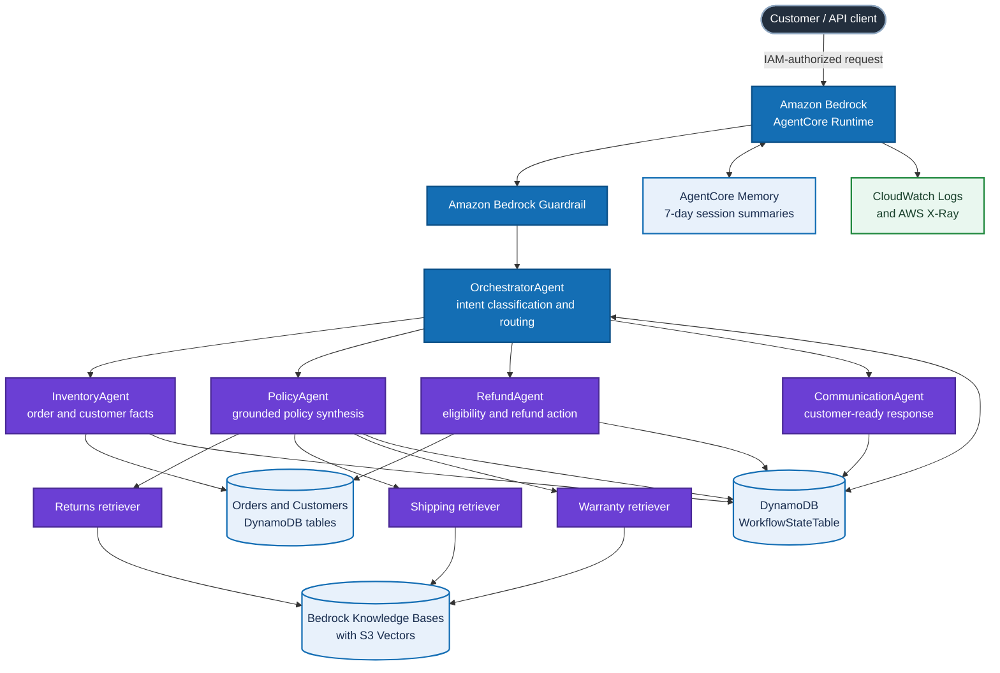
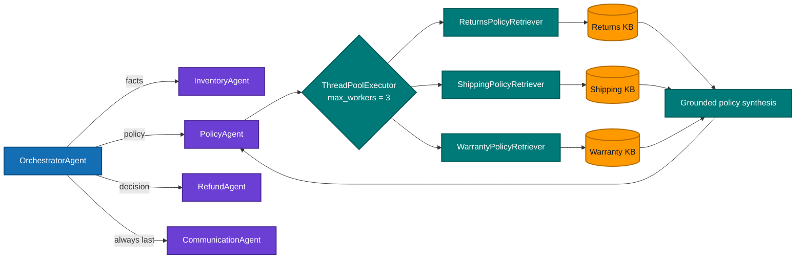
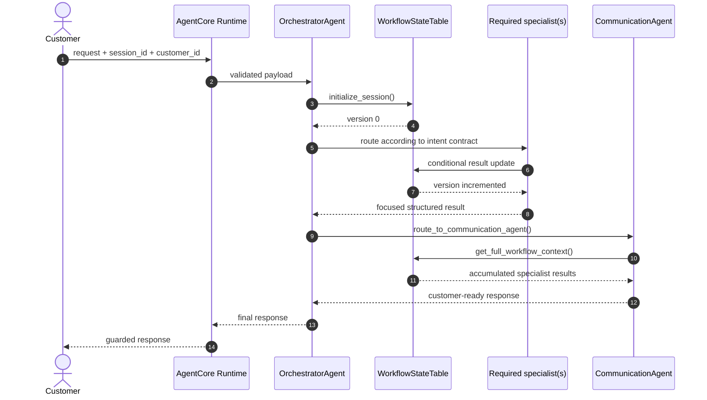
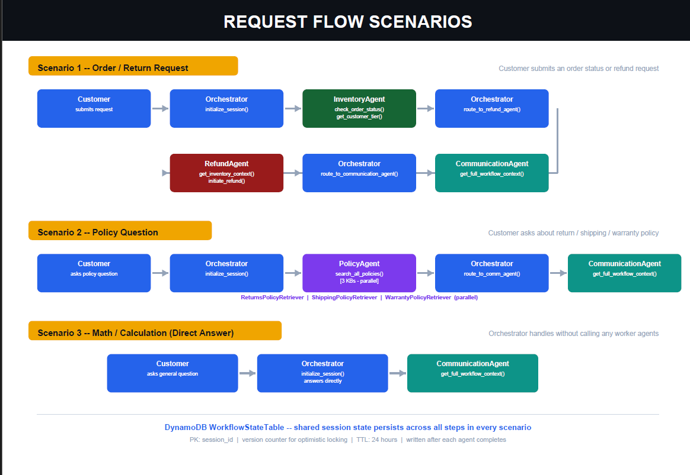
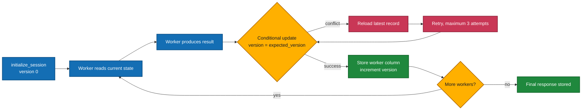
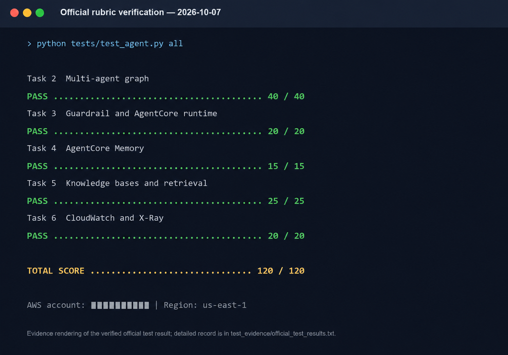

# Architecture Notes

This document explains the implementation decisions behind NovaMart's multi-agent customer-support workflow. For the deployment-level AWS view, see [System Architecture](SYSTEM_ARCHITECTURE.md).

## Architecture overview

The solution separates coordination from domain work. The orchestrator owns routing and sequencing, while each worker owns a narrow prompt and minimal tool surface. This makes routing independently testable and keeps policy retrieval, transactional work, and customer communication from becoming one oversized prompt.

## Agent and retrieval design

The PolicyAgent fans out to three independent retrievers and joins their results before synthesis. The retrieval wrapper isolates Bedrock Knowledge Bases API details from agent prompts, keeping the agent focused on reasoning over grounded passages.

## Request flow

The routing contract is explicit:

| Request type | Route before final communication |
|---|---|
| Account details or customer tier | Inventory only; never Policy |
| Order status or history | Inventory, then Refund for evaluation only |
| Policy-only question | Policy |
| Explicit return or refund | Inventory, then Policy, then Refund |
| Mixed order and policy | Inventory, then Policy |
| Arithmetic | Orchestrator calculation; no Inventory, Policy, or Refund |

CommunicationAgent is always the final worker. An order-status route through RefundAgent evaluates status or eligibility; it never authorizes a refund unless the customer explicitly requests one.

*Figure 1 — Representative execution paths. Every path uses shared workflow state and ends with CommunicationAgent.*

## Shared state and consistency

`WorkflowStateTable` uses `session_id` as its partition key. The record stores `customer_id`, `created_at`, a 24-hour `ttl`, a monotonic `version`, and one result column per worker. `_update_workflow_state()` uses `expected_version` in a DynamoDB condition and retries after conflicts, preventing stale workers from silently overwriting newer results.

AgentCore Memory is complementary rather than duplicated storage: DynamoDB holds one request's structured operational state, while the `SESSION_SUMMARY` strategy retains conversational summaries for seven days.

## Verification evidence

*Figure 2 — Sanitized rendering of the recorded official rubric result. The AWS account number is intentionally redacted; the original evidence remains in the private submission package.*

The recorded rubric run reports **120/120** across the multi-agent graph, AgentCore runtime and guardrail, AgentCore Memory, knowledge bases, and observability. This score verifies the rubric checks captured in the private evidence; it does not claim a successful live-model response where the Udacity sandbox lacked the required model entitlement.

## Safety and operations

- Service boundaries validate input and configuration before invoking agents.
- Bedrock Guardrail outcomes become controlled responses rather than unhandled failures.
- Telemetry uses process-local keyed pseudonyms by default, omits raw request text, and records tool argument names without their values.
- Resource identifiers come from environment variables or ignored local configuration files.
- The optional AgentCore Gateway uses IAM authorization and a dedicated role restricted to configured Lambda targets.
- Cleanup is part of the lifecycle because model calls, storage, S3 Vectors, memory, and logs can incur charges.
