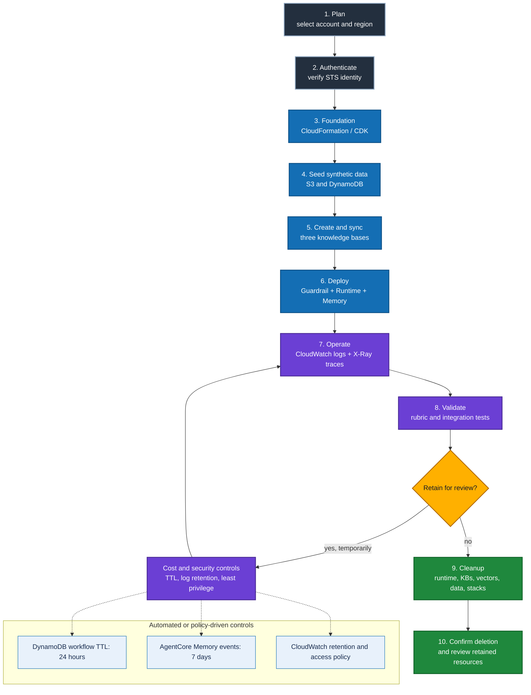

# CI/CD and Resource Lifecycle

The repository separates credential-free continuous integration from protected, manually approved AWS delivery. This prevents pull requests from receiving cloud credentials and prevents ordinary pushes from creating chargeable resources.

## CI/CD pipeline

```mermaid
flowchart LR
    Dev([Developer]) --> Branch[Feature branch]
    Branch --> PR[Pull request to main]
    PR --> Validate

    subgraph Validate[GitHub Actions: Validate]
        direction TB
        Checkout[Checkout] --> Python[Python 3.12 + dependencies]
        Python --> Static[Ruff + compileall]
        Static --> Security[Public-repository and<br/>secure-default tests]
        Security --> Contract[Routing and model<br/>contract tests]
        Contract --> Rubric[Credential-free<br/>Task 2 rubric suite]
        Rubric --> CDK[Node.js 20<br/>CDK build and tests]
    end

    CDK --> Gate{All checks pass?}
    Gate -->|no| Fix[Fix branch and rerun]
    Fix --> PR
    Gate -->|yes| Main[Merge to main]
    Main --> Dispatch[Manual workflow_dispatch]
    Dispatch --> Approval{Protected aws-course<br/>environment approval}
    Approval -->|rejected| Stop[No AWS changes]
    Approval -->|approved| OIDC[GitHub OIDC<br/>short-lived credentials]
    OIDC --> Identity[Confirm AWS identity]
    Identity --> CFNValidate[Validate CloudFormation]
    CFNValidate --> Deploy[Deploy foundation stack]
    Deploy --> Outputs[Print sanitized output names]
    Outputs --> Manual[Manual account-specific<br/>AgentCore and KB steps]
    Manual --> Verify[Integration validation]

    classDef source fill:#232F3E,color:#FFFFFF,stroke:#8FA7C1,stroke-width:2px;
    classDef ci fill:#146EB4,color:#FFFFFF,stroke:#0B4F86,stroke-width:2px;
    classDef gate fill:#FFB000,color:#111827,stroke:#B36B00,stroke-width:2px;
    classDef delivery fill:#6B3FD4,color:#FFFFFF,stroke:#4A2A96,stroke-width:2px;
    classDef success fill:#1F883D,color:#FFFFFF,stroke:#116329,stroke-width:2px;
    classDef stop fill:#C93756,color:#FFFFFF,stroke:#8E243B,stroke-width:2px;
    class Dev,Branch,PR,Main source;
    class Checkout,Python,Static,Security,Contract,Rubric,CDK ci;
    class Gate,Approval gate;
    class Dispatch,OIDC,Identity,CFNValidate,Deploy,Outputs,Manual delivery;
    class Verify success;
    class Fix,Stop stop;
```

### Continuous integration

The `Validate` workflow runs on pushes and pull requests to `main`. It has only `contents: read` permission and receives no AWS credentials. The workflow:

1. Installs Python 3.12 and development dependencies.
2. Runs core Ruff correctness rules and compiles the Python sources.
3. Rejects committed credentials, account identifiers, private runtime configuration, and generated deployment output.
4. Verifies secure defaults, model configuration, and the six-rule routing contract.
5. Executes the credential-free Task 2 assignment suite.
6. Builds and tests the AgentCore CDK project with Node.js 20.

### Continuous delivery

The `Deploy foundation stack` workflow is manual-only because it can create chargeable AWS resources. A protected `aws-course` environment supplies the approval boundary. After approval, GitHub OIDC exchanges the workflow identity for short-lived AWS credentials; the repository never stores a long-lived AWS access key.

## Resource lifecycle management

The lifecycle has two kinds of cleanup. TTL and retention policies reduce stale operational data, but they do not remove the full deployment. The evaluator or project owner must still delete AgentCore resources, knowledge bases, S3 Vector resources, S3 objects, DynamoDB tables, IAM roles, and infrastructure stacks when the review window ends.

## One-time GitHub and AWS setup

1. In the target AWS account, create an IAM OIDC provider for GitHub Actions.
2. Create a deployment role whose trust policy is restricted to this repository and the `aws-course` environment.
3. Grant only the permissions needed to validate and deploy `infrastructure/starter_stack.yaml`.
4. Create the protected GitHub Environment `aws-course` and enable required reviewers.
5. Add the role ARN as the repository variable `AWS_ROLE_ARN`; never add access keys as repository secrets.

## Running delivery

Open **Actions -> Deploy foundation stack -> Run workflow**, verify the AWS region and stack name, and approve the protected environment. The workflow confirms the assumed identity, validates the template, deploys the foundation stack, and prints only sanitized output keys and descriptions.

## Intentional manual boundary

Knowledge-base creation and synchronization, model entitlements, Guardrail and AgentCore Runtime deployment, AgentCore Memory, optional Gateway resources, live-model validation, and final cleanup remain manual. These steps are account-specific, can incur cost, and should not run from an unreviewed push. Follow [Deployment Guide](DEPLOYMENT.md) after the foundation workflow succeeds.

## Failure and rollback behavior

- A failed CI job blocks merge when branch protection requires the `Validate` workflow.
- A rejected environment approval results in no AWS changes.
- CloudFormation failure reports the failing event and preserves a reviewable stack history.
- AgentCore or knowledge-base failures are corrected manually before integration tests are rerun.
- Cleanup is explicit and verified; an empty deployment change set is treated as success by the delivery workflow.
