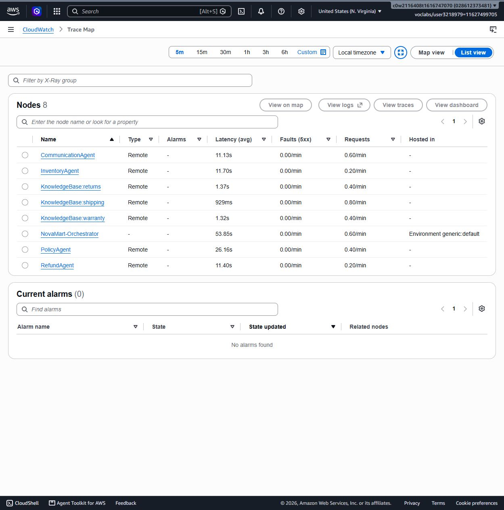
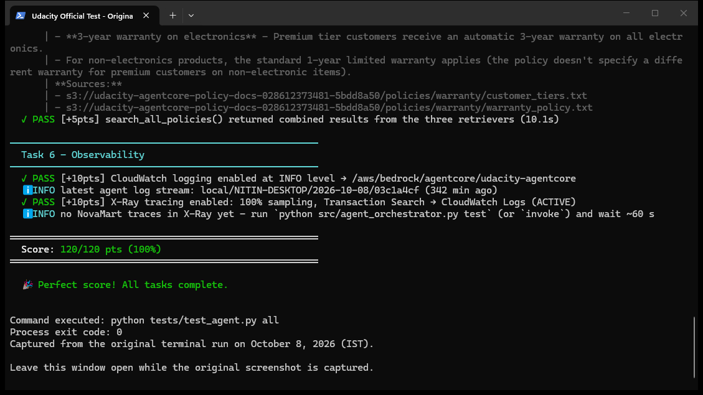

# Live Experiment and Screenshot Evidence Report

## Reviewer summary

This report is the evidence index for the Udacity **Multi-Agent E-commerce RAG** submission. It connects the implementation to the terminal results and AWS Console views used for evaluation.

## Environment verified

| Field | Verified value |
|---|---|
| Evidence date | October 8, 2026 |
| AWS account | `028612373481` (Udacity sandbox) |
| Region | `us-east-1` (N. Virginia) |
| Project | `udacity-agentcore` |
| Runtime | `udacity_agentcore_runtime-u71naiDhDx` |
| Guardrail | `up6axh4lt0of`, version `1` |
| Returns KB | `NYXVNW9GJN` |
| Shipping KB | `BTHTUIKUYI` |
| Warranty KB | `JHJBT4FYVM` |
| Official rubric result | `120/120` |

## Fresh end-to-end experiment

The experiment was rerun from the repository root against the Udacity sandbox with the exact rubric entrypoint:

```powershell
$env:PYTHONUTF8 = "1"
$env:ORCHESTRATOR_MODEL_ID = "amazon.nova-lite-v1:0"
python src/agent_orchestrator.py test
```

`PYTHONUTF8=1` prevents the Windows console from rejecting the test runner's Unicode separators. The temporary orchestrator override is required because the Udacity sandbox blocks the Marketplace entitlement used by the submitted Claude Haiku 4.5 default. `config.py` retains the rubric-required Haiku 4.5 default; all worker agents used the submitted Claude Sonnet 4.5 default during this run.

### Observed execution

| Scenario | Observed route | Result |
|---|---|---|
| Return request for `ORD-27176` | Orchestrator -> Inventory -> Policy -> three parallel KB retrievers -> Refund -> Communication | Completed |
| Premium return-policy question | Orchestrator -> Policy -> three parallel KB retrievers -> Communication | Completed |
| Five items at $29.99 with 10% discount | Orchestrator arithmetic -> Communication | Completed; `$134.96` |

The final runner published these X-Ray trace IDs:

- `1-6ac7c791-7c49890d0c6e70eeb1ebee05`
- `1-6ac7c7f2-7582997b85d6ab173fcfcfc1`
- `1-6ac7c822-35f5d059f1cfe78eb61f6f34`

After the run, CloudWatch X-Ray was refreshed with the **5 minute** range in `us-east-1`. The live map showed `NovaMart-Orchestrator` connected to `InventoryAgent`, `PolicyAgent`, `RefundAgent`, `CommunicationAgent`, `KnowledgeBase-returns`, `KnowledgeBase-shipping`, and `KnowledgeBase-warranty`.

## X-Ray evidence

The [Trace Map screenshot](../evidence/screenshots/aws-xray-service-map.png) is displayed in the project README so the deployed call graph is visible on the repository landing page. AWS shortens long labels on the map; the List view below records every complete node name and its fault rate.



### What the reviewer should verify

1. The Trace Map is set to the five-minute window in `us-east-1` and shows `NovaMart-Orchestrator` as the central node.
2. The map connects the orchestrator to `InventoryAgent`, `PolicyAgent`, `RefundAgent`, and `CommunicationAgent`.
3. The map also records returns, shipping, and warranty Knowledge Base dependencies as direct X-Ray service edges from the orchestrator.
4. The List view identifies all eight services without truncated labels.
5. Every listed service reports `0.00/min` under **Faults (5xx)**, and **Current alarms** is `0`.

Both views were captured from the AWS Console after the final scenario run and trace-ingestion wait.

## Official test evidence



The complete output is preserved as [`official-all-tasks-2026-10-08-original.txt`](../evidence/transcripts/official-all-tasks-2026-10-08-original.txt) and ends with `120/120 pts (100%)`.

| Task | Rubric area | Recorded score |
|---|---|---:|
| Task 2 | Multi-agent graph, tools, models, and routing | 40/40 |
| Task 3 | Guardrail and AgentCore Runtime | 20/20 |
| Task 4 | AgentCore Memory | 15/15 |
| Task 5 | Knowledge Bases and parallel retrieval | 25/25 |
| Task 6 | CloudWatch and X-Ray observability | 20/20 |
| **Total** | **Official rubric verification** | **120/120** |

### Runtime and Knowledge Base console evidence

- [AgentCore Runtime console capture](../evidence/screenshots/aws-agentcore-runtime.jpg)
- [Three-Knowledge-Base console capture](../evidence/screenshots/aws-knowledge-bases.jpg)
- [Sanitized Task 3 runtime and guardrail output](../evidence/transcripts/task3-runtime-guardrail-sanitized.txt)
- [Sanitized Task 5 retrieval output with non-empty returns, shipping, and warranty passages](../evidence/transcripts/task5-kb-retrieval-sanitized.txt)
- [Sanitized Task 6 output recorded after traces arrived](../evidence/transcripts/task6-observability-after-traces-sanitized.txt)
- [Final trace-generation output](../evidence/transcripts/trace-generation-2026-10-08-original.txt)

## Architecture cross-reference

The [Architecture document](ARCHITECTURE.md#request-flow) owns the request-flow figure, Mermaid diagrams, role/tool matrix, and Shared `WorkflowState` explanation. This report is the only documentation page that embeds or directly indexes observed execution evidence.

## Evidence-to-source traceability

| Claim | Primary artifact | Automated or live check |
|---|---|---|
| All TODO requirements implemented | `src/agent_orchestrator.py` | `python tests/test_agent.py task2` |
| Five-agent graph and tool counts | Agent builders and routing tools | Official Task 2 checks |
| Deterministic routing contract | Orchestrator prompt and `tests/test_routing_contract.py` | Routing unit tests |
| Parallel three-KB retrieval | `build_policy_agent()` and `ThreadPoolExecutor` | Official Tasks 2 and 5 plus live output |
| Guardrail and runtime | deployment helpers, `.env`, runtime screenshot, and Task 3 transcript | Official Task 3 checks |
| Seven-day session summaries | `configure_memory()` | Official Task 4 checks |
| Three synchronized KBs | `infrastructure/create_knowledge_bases.py`, `.env`, KB screenshot, and Task 5 transcript | Official Task 5 checks and live retrieval |
| Distributed tracing | `src/agent_observability.py` | Official Task 6, fresh trace IDs, X-Ray screenshot |
