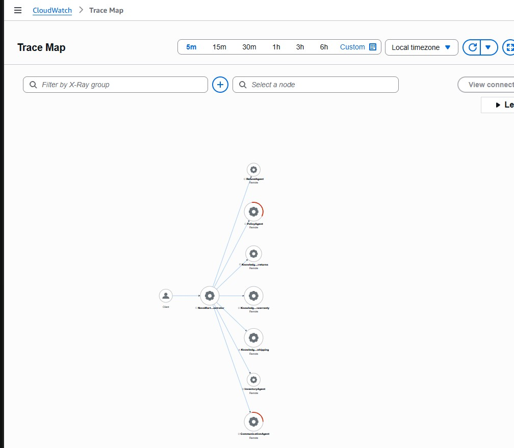
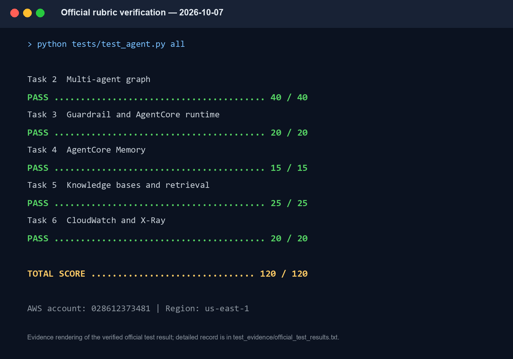

# Live Experiment and Screenshot Evidence Report

## Reviewer summary

This report is the evidence index for the Udacity **Multi-Agent E-commerce RAG** submission. The previous review failed because the GitHub archive did not contain the required AWS X-Ray Service Map image. The repository now includes that original console capture, a clearly labeled rendering of the recorded 120/120 result, the retained result record, the populated non-secret `.env`, source code, and a direct mapping from every artifact to the rubric.

## Environment verified

| Field | Verified value |
|---|---|
| Evidence date | October 8, 2026 |
| AWS account | `028612373481` (Udacity sandbox) |
| Region | `us-east-1` (N. Virginia) |
| Project | `udacity-agentcore` |
| Runtime | `udacity_agentcore_runtime-u71naiDhDx` |
| Guardrail | `up6axh4lt0of`, version `1` |
| Returns KB | `NYXVNW9GJN` |
| Shipping KB | `BTHTUIKUYI` |
| Warranty KB | `JHJBT4FYVM` |
| Official rubric result | `120/120` |

These account and resource identifiers are intentionally visible for course evaluation. They are not authentication secrets. The repository does **not** contain an AWS access key, secret access key, session token, password, federation URL, or browser sign-in token.

## Fresh end-to-end experiment

The experiment was rerun from the repository root against the Udacity sandbox with the exact rubric entrypoint:

```powershell
$env:PYTHONUTF8 = "1"
$env:ORCHESTRATOR_MODEL_ID = "amazon.nova-lite-v1:0"
python src/agent_orchestrator.py test
```

`PYTHONUTF8=1` prevents the Windows console from rejecting the test runner's Unicode separators. The temporary orchestrator override is required because the Udacity sandbox blocks the Marketplace entitlement used by the submitted Claude Haiku 4.5 default. `config.py` retains the rubric-required Haiku 4.5 default; all worker agents used the submitted Claude Sonnet 4.5 default during this run.

### Observed execution

| Scenario | Observed route | Result |
|---|---|---|
| Return request for `ORD-27176` | Orchestrator -> Inventory -> Policy -> three parallel KB retrievers -> Refund -> Communication | Completed |
| Premium return-policy question | Orchestrator -> Policy -> three parallel KB retrievers -> Communication | Completed |
| Five items at $29.99 with 10% discount | Orchestrator arithmetic -> Communication | Completed; `$134.96` |

The runner reported successful publication of these X-Ray trace IDs:

- `1-6ac75d38-9e9437bed32ffb5c2492dd5c`
- `1-6ac75d93-e77bb0d0f86d464a040337f8`
- `1-6ac75dc9-345ba4b7c64e92f4928d5bbf`

After the run, CloudWatch X-Ray was refreshed with the **5 minute** range in `us-east-1`. The live map showed `NovaMart-Orchestrator` connected to `InventoryAgent`, `PolicyAgent`, `RefundAgent`, `CommunicationAgent`, `KnowledgeBase-returns`, `KnowledgeBase-shipping`, and `KnowledgeBase-warranty`.

## Required X-Ray Service Map evidence



### What the reviewer should verify

1. The AWS console is on the X-Ray/CloudWatch Trace Map in `us-east-1`.
2. `NovaMart-Orchestrator` is the central service node.
3. Worker nodes include `InventoryAgent`, `PolicyAgent`, `RefundAgent`, and `CommunicationAgent`.
4. Policy retrieval includes the returns, shipping, and warranty Knowledge Base nodes.
5. Directed edges form the required orchestrator -> worker -> Knowledge Base call chain.

This is an original AWS Console capture, not a Mermaid diagram or a reconstructed graphic. The live map was regenerated and visually rechecked after the fresh experiment above.

## Recorded official test result



| Task | Rubric area | Recorded score |
|---|---|---:|
| Task 2 | Multi-agent graph, tools, models, and routing | 40/40 |
| Task 3 | Guardrail and AgentCore Runtime | 20/20 |
| Task 4 | AgentCore Memory | 15/15 |
| Task 5 | Knowledge Bases and parallel retrieval | 25/25 |
| Task 6 | CloudWatch and X-Ray observability | 20/20 |
| **Total** | **Official rubric verification** | **120/120** |

This is a presentation rendering of the retained result record, not an original terminal screenshot. The source record is available as [`evidence/official_test_results.txt`](../evidence/official_test_results.txt). The rendering intentionally shows the Udacity account number so the evaluator can correlate the result with the deployed sandbox. A sanitized rendering remains available as `diagrams/official-tests-120-of-120-summary-redacted.png` for contexts where the account number is unnecessary.

## Architecture cross-reference

The [Architecture document](ARCHITECTURE.md#request-flow) owns the request-flow figure, Mermaid diagrams, role/tool matrix, and Shared `WorkflowState` explanation. This evidence report keeps observed execution evidence together: the original X-Ray console capture, the rendered score summary, and its retained result record.

## Evidence-to-source traceability

| Claim | Primary artifact | Automated or live check |
|---|---|---|
| All TODO requirements implemented | `src/agent_orchestrator.py` | `python tests/test_agent.py task2` |
| Five-agent graph and tool counts | Agent builders and routing tools | Official Task 2 checks |
| Deterministic routing contract | Orchestrator prompt and `tests/test_routing_contract.py` | Routing unit tests |
| Parallel three-KB retrieval | `build_policy_agent()` and `ThreadPoolExecutor` | Official Tasks 2 and 5 plus live output |
| Guardrail and runtime | deployment helpers and `.env` | Official Task 3 checks |
| Seven-day session summaries | `configure_memory()` | Official Task 4 checks |
| Three synchronized KBs | `infrastructure/create_knowledge_bases.py` and `.env` | Official Task 5 checks and live retrieval |
| Distributed tracing | `src/agent_observability.py` | Official Task 6, fresh trace IDs, X-Ray screenshot |
| No published AWS credentials | repository safety test | `python -m unittest tests.test_public_repository -v` |

## Security boundary

Included for evaluation:

- Udacity AWS account number
- Guardrail, Knowledge Base, runtime, request, and trace identifiers
- original AWS X-Ray console screenshot
- rendered 120/120 summary and retained result record
- populated non-secret `.env`

Never included:

- AWS access keys
- AWS secret access keys
- AWS session tokens
- passwords, OTPs, or federation/sign-in URLs
- personal-account credentials
