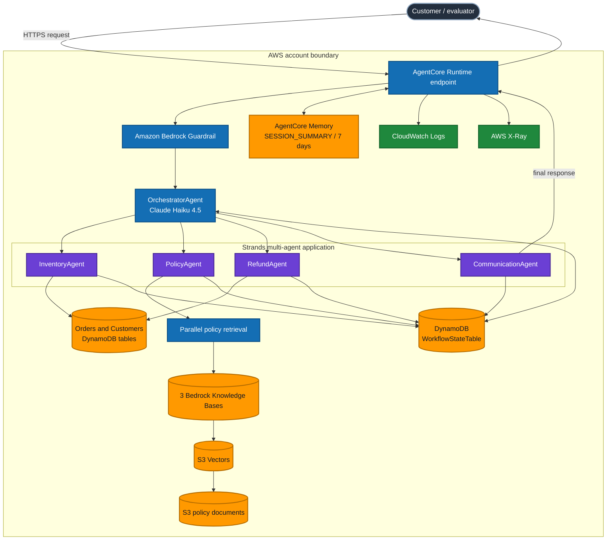
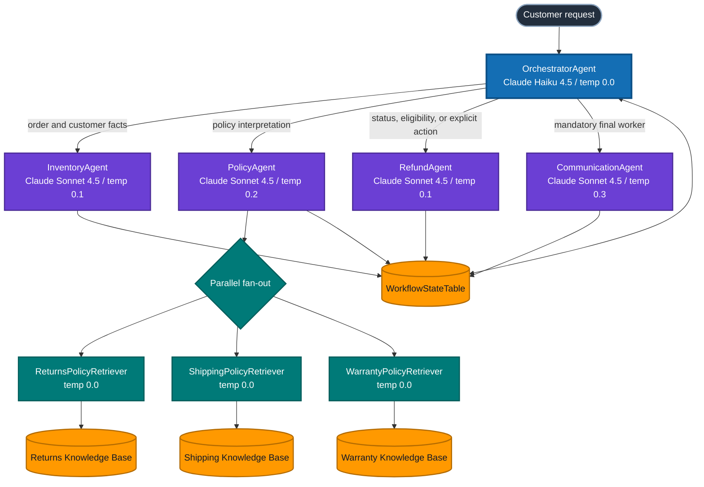
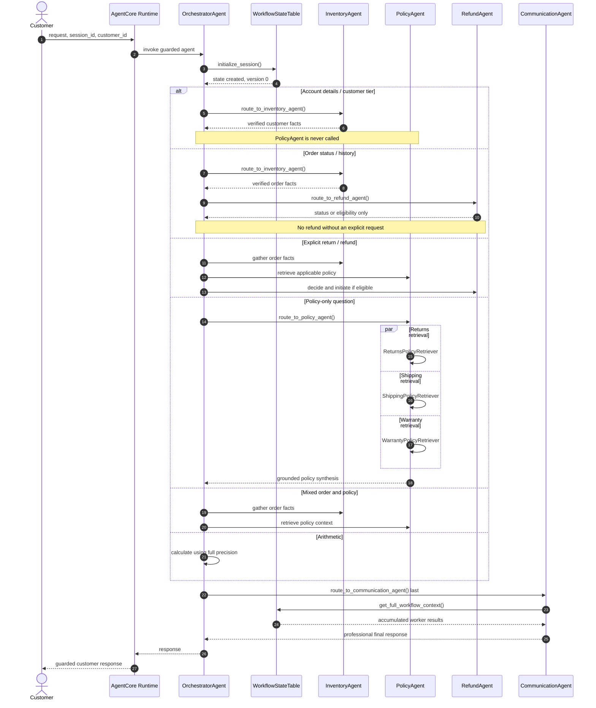
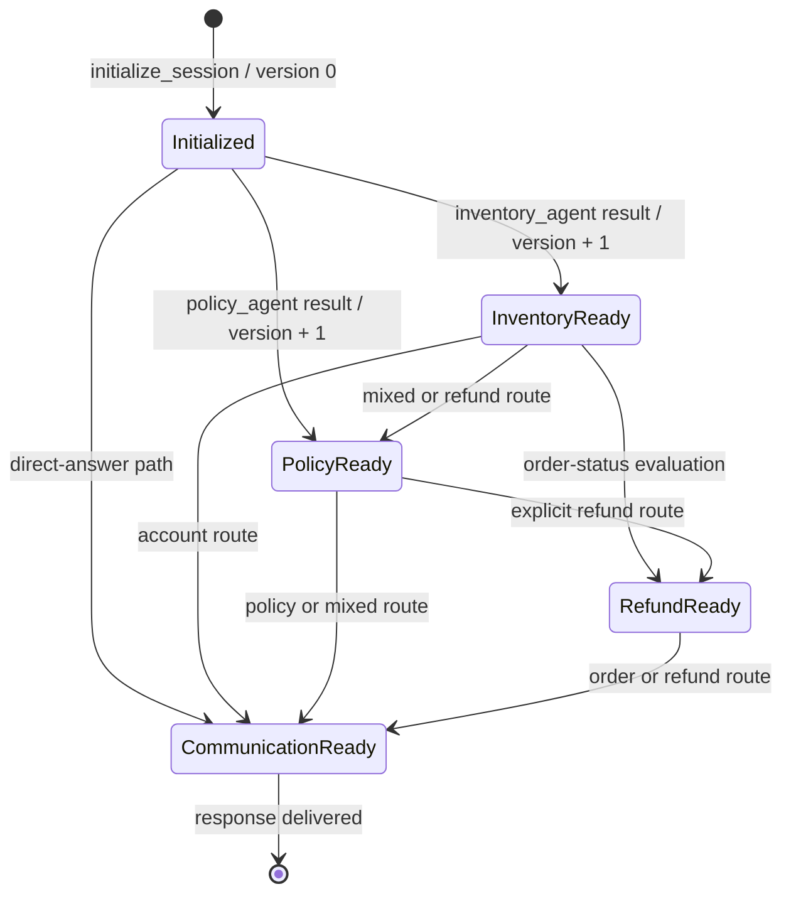
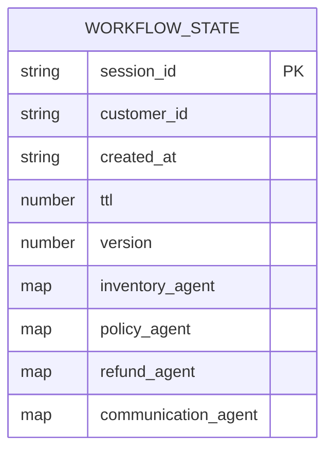

# System Architecture

This document provides four complementary views of the NovaMart solution: AWS deployment topology, agent relationships, request sequencing, and shared workflow state. Mermaid source is stored with the documentation so reviewers can inspect and render every diagram directly in GitHub.

## AWS deployment topology

**Legend:** dark slate = external actor; blue = AWS managed/control plane; purple = application agents; orange = persistent or retrieval data; green = observability.

## Agent Graph

| Agent | Responsibility | Tools |
|---|---|---|
| OrchestratorAgent | Initialize state, choose specialists, enforce the routing contract, and call Communication last | `initialize_session`, four `route_to_*` tools |
| InventoryAgent | Retrieve order and customer facts without making policy decisions | `check_order_status`, `get_customer_tier`, `list_customer_orders` |
| PolicyAgent | Retrieve three policy domains concurrently and synthesize grounded context | `search_all_policies` |
| RefundAgent | Evaluate return status/eligibility and initiate only an explicitly requested eligible refund | `get_inventory_context`, `initiate_refund` |
| CommunicationAgent | Read accumulated state and compose the final customer-facing response | `get_full_workflow_context` |

## Request Flow

| Request type | Required route before CommunicationAgent |
|---|---|
| Account details or customer tier | Inventory only; never Policy |
| Order status or history | Inventory, then Refund for evaluation only |
| Policy-only | Policy |
| Explicit return or refund | Inventory, then Policy, then Refund |
| Mixed order and policy | Inventory, then Policy |
| Arithmetic | Orchestrator calculation; no specialist |

Every route initializes the session first and ends with CommunicationAgent. Worker output is persisted between steps instead of being passed only through model prompts.

## Shared WorkflowState

| Field | Purpose |
|---|---|
| `session_id` | DynamoDB partition key for one workflow |
| `customer_id` | Synthetic customer associated with the request |
| `created_at` / `ttl` | Audit timestamp and automatic 24-hour expiry |
| `version` | Optimistic-lock counter used by conditional writes |
| Worker result columns | Structured facts, policy context, refund decision, and final response |

`_update_workflow_state()` writes only when the stored version equals `expected_version`. On conflict, it reloads the record and retries up to three times. This protects concurrent or delayed worker updates from silently replacing newer state.

AgentCore Memory serves a different scope: `WorkflowStateTable` contains operational state for one workflow, while the seven-day `SESSION_SUMMARY` strategy provides conversational continuity.

## Security and reliability boundaries

- An IAM-authorized caller invokes the runtime; production identity ownership must be enforced outside the model.
- Bedrock Guardrail configuration applies to each agent model invocation.
- The public repository contains placeholders, not deployed identifiers or credentials.
- Logs omit raw prompts and tool values by default; identifiers are pseudonymized for telemetry.
- GitHub delivery uses OIDC and a protected environment, keeping long-lived AWS keys out of CI/CD.
- DynamoDB TTL, AgentCore Memory expiry, log retention, and explicit teardown manage data and cost over the deployment lifecycle.
