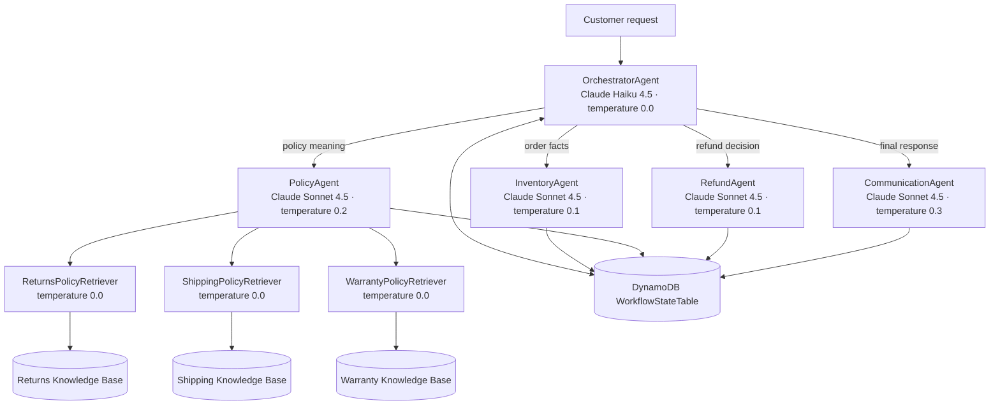
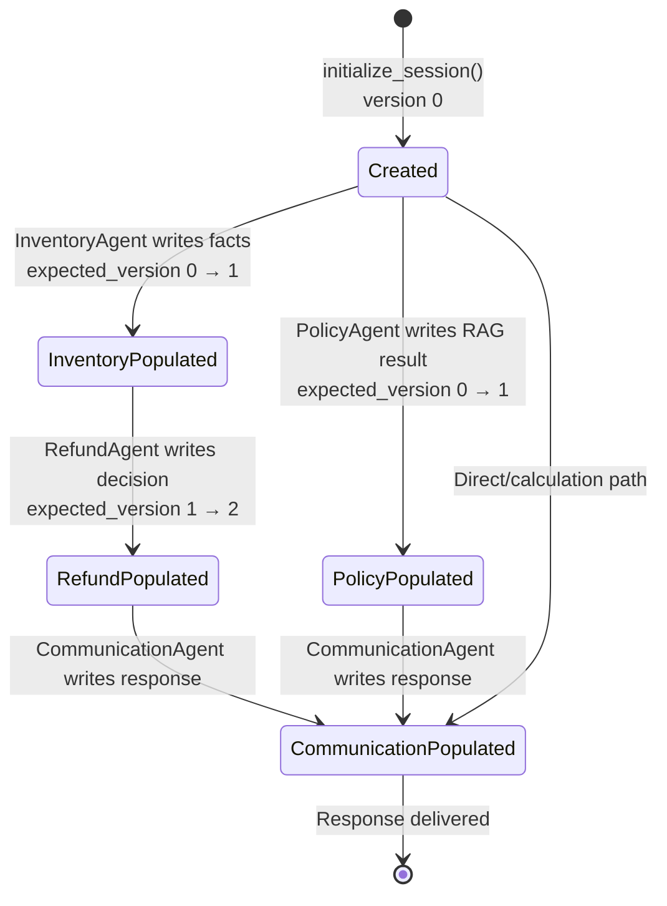

# System Architecture

This document mirrors the three architectural views required by the Udacity Multi-Agent E-commerce RAG module and maps them to the submitted implementation. The diagrams are maintained as Mermaid source so reviewers can inspect changes directly in GitHub.

## Agent Graph



| Agent | Responsibility | Tools |
|---|---|---|
| OrchestratorAgent | Initialize state, choose specialists, and enforce final communication | `initialize_session`, `route_to_inventory_agent`, `route_to_policy_agent`, `route_to_refund_agent`, `route_to_communication_agent` |
| InventoryAgent | Retrieve order and customer facts without making policy decisions | `check_order_status`, `get_customer_tier`, `list_customer_orders` |
| PolicyAgent | Fan out across three knowledge bases and synthesize grounded policy context | `search_all_policies` |
| RefundAgent | Apply Standard/Premium return windows and initiate an eligible return | `get_inventory_context`, `initiate_refund` |
| CommunicationAgent | Read accumulated state and create the final customer-facing response | `get_full_workflow_context` |

## Request Flow

```mermaid
sequenceDiagram
    autonumber
    actor Customer
    participant O as OrchestratorAgent
    participant W as WorkflowStateTable
    participant I as InventoryAgent
    participant R as RefundAgent
    participant P as PolicyAgent
    participant C as CommunicationAgent

    Customer->>O: Request with session and customer context
    O->>W: initialize_session()
    alt Account details / customer tier
        O->>I: route_to_inventory_agent()
        I-->>O: Verified customer facts (never PolicyAgent)
        O->>W: Store inventory_agent result
    else Order status / history
        O->>I: route_to_inventory_agent()
        I-->>O: Verified order and customer facts
        O->>W: Store inventory_agent result
        O->>R: route_to_refund_agent()
        R->>W: Read inventory context
        R-->>O: Status or eligibility evaluation only
        O->>W: Store refund_agent result
    else Explicit return / refund request
        O->>I: route_to_inventory_agent()
        O->>P: route_to_policy_agent()
        O->>R: route_to_refund_agent()
        R-->>O: Decision; initiate only when explicitly requested
    else Policy question
        O->>P: route_to_policy_agent()
        par Parallel RAG
            P->>P: Returns retriever
        and
            P->>P: Shipping retriever
        and
            P->>P: Warranty retriever
        end
        P-->>O: Grounded policy synthesis
        O->>W: Store policy_agent result
    else Calculation / general response
        O->>O: Resolve deterministic calculation or context
    end
    O->>C: route_to_communication_agent()
    C->>W: Read full workflow context
    C-->>O: Professional final response
    O-->>Customer: Return composed response
```

Routing rules intentionally keep the orchestrator focused on coordination. Sending an order-status request to RefundAgent means evaluating status or eligibility; it does not authorize a refund unless the customer explicitly requests one. The orchestrator does not replace CommunicationAgent as the final customer-facing writer.

| Request type | Required route before final communication |
|---|---|
| Account details or customer tier | Inventory only; never Policy |
| Order status or history | Inventory, then Refund for evaluation only |
| Policy only | Policy |
| Explicit return or refund | Inventory, then Policy, then Refund |
| Mixed order and policy | Inventory, then Policy |
| Arithmetic | Orchestrator calculation; no Inventory, Policy, or Refund |

Every row ends with CommunicationAgent.

## Shared WorkflowState



Each record uses `session_id` as the DynamoDB partition key and contains:

| Field | Purpose |
|---|---|
| `session_id` | Unique workflow key |
| `customer_id` | Synthetic course customer associated with the workflow |
| `created_at` / `ttl` | Audit timestamp and 24-hour expiry |
| `version` | Optimistic-lock counter |
| `inventory_agent` | Verified order/customer facts |
| `policy_agent` | Grounded multi-KB policy output |
| `refund_agent` | Eligibility decision and return reference |
| `communication_agent` | Final response text |

`_update_workflow_state()` uses a conditional DynamoDB update with `expected_version`. On a conflict it reloads the latest record and retries, preventing a stale worker result from silently replacing newer state.

AgentCore Memory is complementary: DynamoDB tracks one workflow's structured operational state, while the seven-day `SESSION_SUMMARY` strategy provides conversational continuity across runtime sessions.
