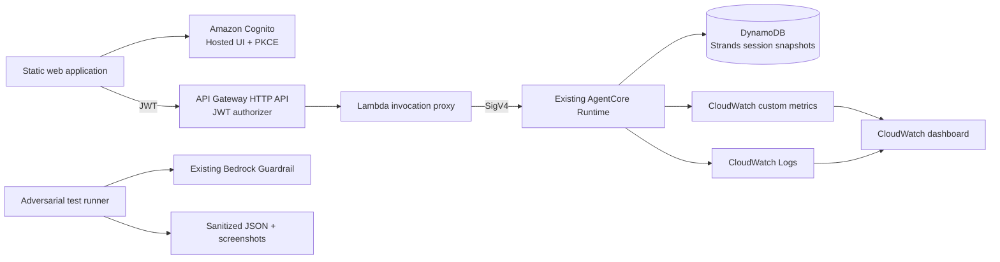

# Optional Production Enhancements Design

Date: 2026-10-08  
Status: Approved design; implementation not started  
Target: Udacity AWS sandbox first, personal AWS account only if the sandbox blocks required services

## 1. Purpose

Extend the passing Multi-Agent E-commerce RAG project with every optional enhancement listed under the Udacity rubric's “Suggestions to Make Your Project Stand Out” section:

1. adversarial Bedrock Guardrail validation with evidence;
2. persistent Strands conversation sessions backed by DynamoDB;
3. a CloudWatch operations dashboard;
4. a Cognito-authenticated web frontend that invokes the AgentCore Runtime through a protected backend.

The enhancement must be genuinely deployed and tested. Documentation will distinguish deployed evidence from design intent and will never claim a successful resource or scenario without a live check.

## 2. Constraints and non-goals

- Preserve the required implementation and its verified 120/120 behavior.
- Keep optional resources in a separate stack so optional deployment or cleanup cannot damage the rubric resources.
- Use `us-east-1` and the Udacity account first.
- Fall back to the personal AWS account only after a concrete Udacity permission or service restriction is observed.
- Never publish access keys, secret keys, session tokens, passwords, Cognito user passwords, hosted-UI authorization codes, JWTs, refresh tokens, or federation URLs.
- The frontend is an evaluator demonstration, not a production commerce portal. It will not implement checkout, payments, or administrative customer management.
- Optional enhancements are not allowed to weaken the existing IAM, observability, routing, state-management, or cleanup controls.

## 3. Deployment boundary

Create a second CloudFormation stack named `udacity-agentcore-optional`. It owns only optional resources and consumes the existing runtime ARN and log-group name as parameters.



The existing required stack remains authoritative for orders, customers, workflow state, policies, the runtime role, log group, and S3 Vectors resources.

## 4. Guardrail adversarial validation

### Test cases

The test runner will call the deployed guardrail with deterministic inputs covering:

- prompt-injection and instruction-override attempts;
- competitor product recommendations;
- pricing negotiation;
- legal threats;
- credit-card and SSN input;
- email and phone input;
- profanity;
- a benign NovaMart policy question as a non-blocking control.

### Result handling

Each result records the scenario name, expected action, observed action, matched policy type, timestamp, region, guardrail ID, and version. Raw PII test strings and credentials will not be written to repository evidence. The report will use synthetic masked values and a sanitized response summary.

### Acceptance criteria

- All deny/block cases produce the expected blocked action.
- Email and phone cases demonstrate anonymization rather than unrestricted echoing.
- The benign control remains allowed.
- The AWS Console evidence and machine-readable sanitized results agree.

## 5. Persistent Strands sessions on DynamoDB

### SDK approach

Use the current Strands snapshot architecture: `SnapshotSessionManager` with the AWS-maintained `strands-dynamodb-storage` backend. The currently installed core `strands-agents` package does not expose a built-in `DynamoDbSessionStorage` class, so adding an invented import is explicitly prohibited. The implementation will pin and test the supported DynamoDB storage package and follow the current Strands storage interface.

References:

- [Strands session management](https://strandsagents.com/docs/user-guide/sdk/agents/session-management/)
- [Strands storage backends](https://strandsagents.com/docs/user-guide/sdk/storage/)
- [Strands persistent-memory lesson](https://strandsagents.com/docs/learning/persistent-memory-with-session-managers/)

### Data model

The optional stack creates `novamart-agent-sessions-<suffix>` with on-demand capacity, point-in-time recovery, server-side encryption, TTL, and deletion protection disabled for deterministic course cleanup. Storage keys are namespaced by an identity-derived conversation key, not a raw email or browser-supplied customer ID.

### Runtime integration

- Enable persistence only when `PERSISTENT_SESSION_ENABLED=true` and the table name is configured.
- Build an orchestrator instance for the authenticated conversation using `SnapshotSessionManager`; constructing an agent makes no model call.
- Attach the session manager only to the orchestrator. Worker agents remain stateless specialists and continue using the existing `WorkflowState` table for within-request coordination.
- Preserve AgentCore Memory as the seven-day semantic/session-summary layer. DynamoDB snapshots provide exact conversational continuity; AgentCore Memory remains the summarized memory capability required by the rubric.
- Enforce a single live writer for a conversation and reject overlapping invocations for the same conversation ID.
- Retain sessions for seven days unless a shorter evaluator setting is selected.

### Compatibility mode

When persistence is disabled or unavailable, the runtime follows the existing verified behavior. It must never silently switch to an unencrypted local-file session store in AgentCore Runtime.

## 6. CloudWatch operational dashboard

### Metrics

Publish Embedded Metric Format events from the existing observability module:

- `InvocationCount`
- `SuccessCount`
- `ErrorCount`
- `LatencyMs`
- `GuardrailBlockCount`
- `WorkerInvocationCount`
- `KnowledgeBaseRetrievalCount`
- `KnowledgeBaseRetrievalLatencyMs`

Allowed dimensions are `Project`, `Environment`, `AgentName`, and `Outcome`. Customer IDs, session IDs, request text, tool arguments, order IDs, email addresses, and Cognito subjects are forbidden as metric dimensions or values.

### Dashboard

The optional stack creates a dashboard with:

- total requests, successes, failures, and guardrail blocks;
- p50/p90/p99 end-to-end latency;
- average and p90 latency by agent;
- invocation count by worker;
- Knowledge Base retrieval volume and latency;
- recent error logs and recent guardrail events;
- AgentCore/X-Ray service health links.

Metrics must be generated through live frontend and adversarial-test traffic before screenshots are captured.

## 7. Cognito-authenticated frontend

### Resources

- Cognito User Pool with verified-email sign-in.
- Public app client with no client secret.
- Cognito domain and authorization-code flow with PKCE.
- API Gateway HTTP API with a Cognito/JWT authorizer.
- Lambda invocation proxy.
- Private S3 origin and CloudFront distribution for the static site.
- Least-privilege IAM permitting the proxy to invoke only the configured AgentCore Runtime and write only required logs/metrics.

### Identity and authorization

The browser never sends an authoritative `customer_id`. The proxy derives the customer mapping from trusted Cognito claims. For the evaluator account, an administrator creates a test user whose immutable `custom:customer_id` claim maps to the synthetic `CUST-001` record. The proxy validates issuer and audience through API Gateway, then uses the trusted claim and token subject to construct the runtime payload and conversation namespace.

### Request flow

1. User signs in through Cognito Hosted UI using PKCE.
2. The browser receives tokens in memory; tokens are not stored in source control or logged.
3. The browser sends the access token and prompt to API Gateway.
4. API Gateway validates the JWT before Lambda runs.
5. Lambda discards any browser-supplied customer identity, derives identity from claims, validates prompt length, and invokes AgentCore Runtime using its IAM role.
6. Lambda returns the assistant response, session ID, and safe trace correlation ID.

### User experience

The responsive interface includes authentication state, conversation history, loading/error states, trace/session references, suggested queries, sign-out, and an explicit educational-demo notice. It will use accessible labels, keyboard navigation, visible focus states, and sufficient color contrast.

## 8. Error handling and security

- Return `401` for missing or invalid JWTs and `403` for users without a valid customer mapping.
- Return `400` for empty or oversized prompts and `429` for throttled requests.
- Convert AgentCore timeouts and model-access failures to controlled `502/503` responses without stack traces.
- Configure API throttling, Lambda reserved concurrency, log retention, S3 public-access blocking, CloudFront origin access control, TLS-only bucket policies, and restrictive CORS for the CloudFront origin.
- Pseudonymize operational identifiers using the existing keyed-hash approach.
- Run credential and JWT-pattern scans across tracked files and evidence before every push.
- Do not create or commit a Cognito client secret.

## 9. Planned repository structure

```text
frontend/
  index.html
  app.js
  styles.css
  config.example.js
infrastructure/
  optional_enhancements.yaml
  deploy_optional.py
  cleanup_optional.py
src/
  persistent_sessions.py
  optional_metrics.py
  frontend_proxy.py
tests/
  test_guardrail_adversarial.py
  test_persistent_sessions.py
  test_optional_metrics.py
  test_frontend_proxy.py
docs/
  OPTIONAL_ENHANCEMENTS.md
  OPTIONAL_EVIDENCE.md
```

The final names may change only when required by an AWS or SDK interface discovered during implementation; any change must retain the boundaries defined here.

## 10. Deployment workflow

1. Run all existing credential-free and official rubric tests before changes.
2. Implement and test each optional component locally with AWS clients mocked.
3. Deploy the optional stack to the active Udacity account.
4. If a required service action is denied, record the exact service and denied action, remove any partial optional stack, and deploy the complete optional stack to the personal account. Do not split one optional deployment across two accounts.
5. Create the evaluator Cognito user without recording its password.
6. Publish the frontend configuration generated from stack outputs.
7. Run authenticated frontend scenarios and adversarial guardrail scenarios.
8. Confirm session continuity across separate runtime invocations.
9. Confirm live dashboard metrics and capture original screenshots.
10. Re-run the official 120/120 suite, security checks, frontend tests, infrastructure validation, and GitHub Actions.
11. Update README architecture, evidence links, deployment instructions, and cleanup instructions.

## 11. Testing strategy

### Local and CI

- Unit tests for claim-to-customer mapping, payload validation, error translation, session namespacing, TTL, and concurrency rejection.
- Snapshot storage contract tests using a fake DynamoDB client.
- Metric tests confirming required names and forbidden dimensions.
- CloudFormation linting and resource-policy assertions.
- Static frontend tests for configuration, authentication redirects, token handling, and API error states.
- Existing required rubric tests remain unchanged and must continue passing.

### Live acceptance tests

- Sign-in and sign-out succeed through Cognito Hosted UI.
- Unauthenticated API requests are rejected.
- A signed-in user receives a response from AgentCore Runtime.
- A second request in the same conversation restores prior context from DynamoDB.
- Guardrail scenarios match their expected actions.
- CloudWatch dashboard widgets contain current datapoints.
- X-Ray continues to show the required orchestrator/worker/Knowledge Base topology.

## 12. Evidence and documentation

Original screenshots will show:

- Guardrail adversarial test results in AWS;
- the DynamoDB session table with non-sensitive keys and TTL;
- the populated CloudWatch dashboard;
- Cognito sign-in and the authenticated frontend response;
- API Gateway authorization behavior;
- the unchanged 120/120 rubric result.

`docs/OPTIONAL_EVIDENCE.md` will identify the account, region, stack name, resource identifiers, commands, timestamps, outcomes, and limitations. README will link the optional architecture and evidence without replacing the required submission evidence.

## 13. Cleanup

The optional cleanup command will resolve the exact optional stack, list owned resources, require the expected project tags, empty only the stack-owned frontend bucket, delete the evaluator Cognito user, and remove the optional stack. It will not delete the required assignment stack, Knowledge Bases, AgentCore Runtime, required Guardrail, or required evidence.

## 14. Completion criteria

The enhancement is complete only when:

- all four optional capabilities are implemented;
- one account contains the complete live optional deployment;
- every live acceptance test passes;
- original evidence is committed with sensitive authentication material excluded;
- required assignment tests still report 120/120;
- two independent repository/archive verification passes succeed;
- GitHub Actions succeeds on the final commit;
- cleanup instructions and cost-bearing resources are documented.
